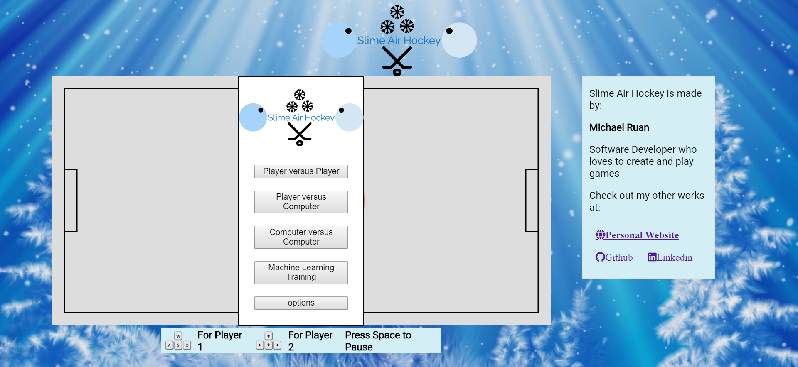

## Slime Air Hockey

###  [Live Website](http://www.michaelruan.xyz/SlimeAirHockey)

### Background

Slime originated from the old browser game Slime Volleyball where each player controls a semicircle character (slime) and plays volleyball each other. For this project, the sport will be the arcade classic air hockey. There will be a goal on either side and points are scored when the player enters the opposite goal. The ball or puck can bounce off all four sides of the wall except for the goal. The game starts off with the puck in the middle and players jockey for the puck. After a goal, the loser gets the initiative to hit the puck first. For this game, players can cross the center line. Game will end after a set amount of time(1 - 2 mins) and winner is decided by who scored the most.

### Functionality and MVP
In this Slime Air Hockey, features include:
*  start and restart game through a menu UI
*  human vs human games
*  human vs simple ai games
*  ai vs ai games
*  human vs ai using learned weights

### UI
This app contains a single screen with game window in the center. Control instructions are on the bottom of the game window. Personal Links such as Linkedin, Github, and Portfolio will be on the right of the game window.

### Architecture and Technologies
*  JavaScript
*  DOM for menu UI
*  brain.js for inspiration on machine learning

The scripts involved for this projects are:

`game_view.js` - handles UI and what type of game to start   
`game.js` - handles the game logic when points are scored and when the game is won  
`slime.js` - handles the players input controls and properties of slime  
`puck.js` - handles the physics of the puck  
`moving_object.js` - handles physics for all moving objects (slime, puck) including wall collisions, and ball to ball collisions  
`AAIslime.js` - handles the logic for the aggressive AI: always goes for the ball  
`RAIslime.js` - handles the logic for the random AI  
`DAIslime.js` - handle the logic for the defensive AI  
`BAIslime.js` - handle the logic for the bossy AI: always goes for the other slime  
`MLslime.js` - handle the logic for "Machined-Learned" AI: used directional weights to determine what direction for the AI is optimal  
